# Architecture

## System Architecture

The platform is a two-mode decision-support application. The React frontend sends analysis requests to the FastAPI backend, which runs either the FAERS signal-detection workflow or the CTD submission-readiness workflow. Results are returned as typed JSON, displayed in the dashboard, and retained in browser session storage for report generation.

```mermaid
flowchart LR
    user([Regulatory or pharmacovigilance user])
    browser[React + Vite web app]
    dashboard[Dashboard and analysis views]
    client[Axios API client]
    reports[Reports view\nPDF print, CSV, JSON export]
    storage[(Browser session storage)]
    api[FastAPI backend\nCORS + typed schemas]

    subgraph signal[Mode 1: FAERS safety signal detection]
        signalRoute[POST /api/signals\ndrug name]
        normalize[Normalize drug name]
        faers[(Processed FAERS CSV)]
        clean[Load, clean, validate\nand count unique reports]
        frequency[Build drug-event\nfrequency table]
        metrics[Compute 2x2 table\nPRR + Yates chi-square\nreporting proportions]
        classify[Classify signal\nPotential / Weak / None]
        trend[Compute quarterly trend]
        signalResponse[Signal response\nmetrics, quality, trends, disclaimer]

        signalRoute --> normalize
        normalize --> clean
        faers --> clean
        clean --> frequency
        frequency --> metrics
        metrics --> classify
        frequency --> trend
        classify --> signalResponse
        trend --> signalResponse
    end

    subgraph readiness[Mode 2: CTD submission readiness]
        readinessRoute[POST /api/readiness\nPDF or TXT dossier]
        validateFile[Validate extension\nand 50 MB limit]
        parse[Extract document headings]
        requirements[(Verified CTD\nrequirements JSON)]
        match[Match headings to\nICH CTD sections]
        score[Calculate module and\noverall completeness]
        gaps[Build missing-section\nand priority gap report]
        readinessResponse[Readiness response\nmodule scores, gaps, matches]

        readinessRoute --> validateFile
        validateFile --> parse
        parse --> match
        requirements --> match
        match --> score
        match --> gaps
        score --> readinessResponse
        gaps --> readinessResponse
    end

    user --> browser
    browser --> dashboard
    dashboard --> client
    client --> api
    api --> signalRoute
    api --> readinessRoute
    signalResponse --> dashboard
    readinessResponse --> dashboard
    dashboard --> reports
    signalResponse --> storage
    readinessResponse --> storage
    storage --> reports
```

Safety signal results are statistical associations only. They do not establish causality or prove that a drug caused an event, and they require qualified clinical and regulatory review.

## Components

| Component | Technology | Responsibility |
|---|---|---|
| Frontend | React 18, TypeScript, Vite, Material UI, Recharts | Dashboard navigation, analysis forms, tables, charts, report preview, and exports |
| Backend API | FastAPI, Uvicorn, Pydantic | REST endpoints, request validation, orchestration, and typed responses |
| Signal services | Pandas, NumPy, Python services | FAERS loading, drug normalization, frequency tables, PRR, Chi-square, classification, and trends |
| Readiness services | `pdfminer.six`, Python services | PDF/TXT heading extraction and CTD requirement matching |
| Requirements and datasets | CSV and JSON files | Processed FAERS reports, demo data, and verified CTD requirements |
| Browser persistence | `sessionStorage` | Retain the latest signal and readiness results for the Reports view |
| IBM technology | IBM Bob | Development and intelligent assistance layer used by the project |

## Data Flow

### Safety signal workflow

1. The user enters a drug name in the Signal Detection view.
2. The frontend sends the name to `POST /api/signals` through the Vite development proxy.
3. The backend normalizes the drug name and loads the processed FAERS CSV.
4. The loader cleans the records, validates data quality, and counts unique report IDs.
5. The signal engine builds drug-event contingency tables and calculates PRR, Yates-corrected Chi-square, and reporting proportions.
6. Configured thresholds classify each drug-event pair as a Potential Safety Signal, Weak / Emerging Signal, or No Signal.
7. Quarterly trend points are computed when report dates are available; the API returns the ranked results with data-quality information and a safety disclaimer.

### Submission readiness workflow

1. The user uploads a `.pdf` or `.txt` dossier in the Submission Readiness view.
2. The backend validates the file type and rejects files larger than 50 MB.
3. The document parser extracts headings from the uploaded content.
4. The CTD checker compares headings with the verified requirements in `ctd_requirements.json`.
5. The service calculates module-level and overall completeness percentages.
6. Missing sections are returned as prioritized gaps, along with matched section IDs.

### Reporting workflow

1. Completed signal and readiness responses are stored in browser `sessionStorage`.
2. The Reports view reads the latest available results and can show a safety, readiness, or combined report.
3. The user can print the report to PDF or download CSV and JSON representations.

## Security Considerations

This is a hackathon prototype and does not currently implement authentication or authorization. The backend enables CORS only for the local frontend development origins (`localhost:5173` and `localhost:3000`).

- Uploaded files are processed in memory by the readiness endpoint and are not persisted by the backend.
- The readiness endpoint enforces `.pdf` and `.txt` extensions and a 50 MB upload limit.
- Report data is stored in browser session storage and is cleared when the session is cleared.
- Safety results include a non-causality disclaimer and should be reviewed by qualified experts before clinical or regulatory decisions.
- A production deployment should add authentication, HTTPS, malware scanning, stricter CORS configuration, rate limiting, audit logging, and managed secrets.

## Scalability Notes

The FastAPI layer is stateless for the current workflows and could be replicated behind a load balancer. For larger datasets, FAERS cleaning and frequency-table construction should move to an offline pipeline or analytical store rather than re-reading the CSV for every request. A production system could add asynchronous document processing, a persistent audit/report store, background jobs for scheduled signal scans, cached drug analyses, and regional CTD requirement sets. The statistical outputs would remain decision-support evidence and would still require expert review.
